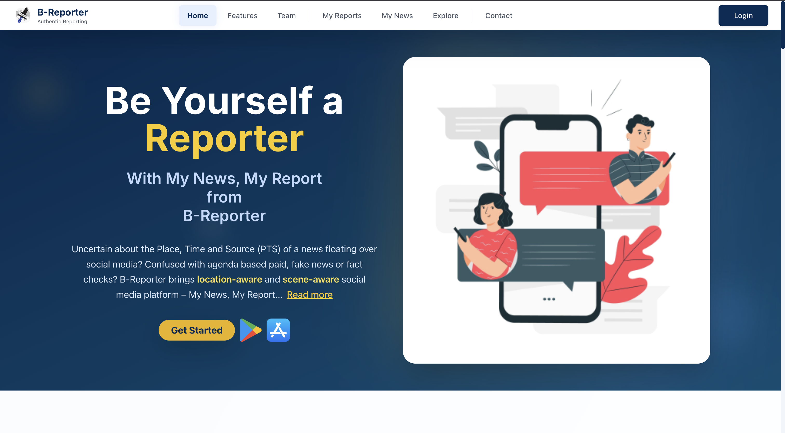
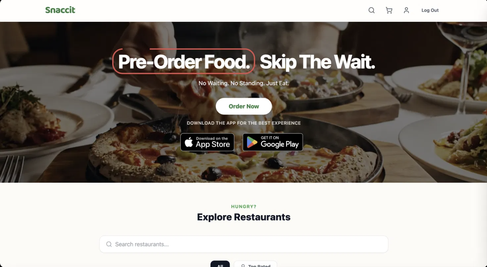

# Hey, I'm Pushkin 👋

**B.Tech + M.Tech CSE Dual Degree @ IIT Delhi · ARRA Scholar**
Building `My News My Report` @ B-Reporter · CTO @ Snaccit · SAC Technical Secretary

<!-- TODO: swap in your real profile picture URL if different from your GitHub avatar -->
<!-- TODO: add badges — LinkedIn, X/Twitter, portfolio site, email — replace # with real links -->

---

### 👨‍💻 About Me

- 🎓 Dual Degree (B.Tech + M.Tech) in Computer Science, **IIT Delhi** — **ARRA Scholar**
- 🏛️ **SAC Technical Secretary** (Institute-level) & Hostel Tech Secretary, Jwalamukhi
- 📈 Pursuing a **Minor in Entrepreneurship**
- 🚀 CEO @ **B-Reporter** · CTO & Co-Founder @ **Snaccit**
- 🔬 Researching forest ecosystem resilience with causal ML under Prof. Aaditeshwar Seth (SURA project)

---

## 🚀 Startups

### 📰 B-Reporter — *"My News My Report"*
A civic/grievance reporting platform — website, mobile apps, and a companion Watch app, all built to get citizen reports directly to the right authorities.

- 🏅 2 patents · 1 publication · IIT-Delhi grant
- 🤝 Collaborations with DRDO and the Women's Commission
- 🌱 Part of the **IIT Delhi Venture Studio** accelerator

[🌐 Website](https://b-reporter.com/) · [🤖 Android](https://play.google.com/store/apps/details?id=com.iitd.breporter3) · [🍎 iOS](https://apps.apple.com/in/app/my-news-my-report/id6744141391) · [⌚ Watch App](#) <!-- TODO: link when available -->

<!-- Use your homepage screenshot here — save it to assets/breporter-preview.png in the repo -->

 

🎪 A project under this umbrella was showcased at the <b>IIT Delhi Open House 2025</b> (Makerspace), earning a Letter of Appreciation.

 

### 🍔 Snaccit
Co-founded and engineered the core product — a suite of 3 websites and 2 apps.

[🌐 Main Site](https://www.snaccit.com/) · [🤝 Partners Portal](https://partners.snaccit.com/) · [🛠️ Admin Portal](https://admin.snaccit.com/) · [🤖 Android](https://play.google.com/store/apps/details?id=com.snaccit.app&hl=en) · [🍎 iOS](https://apps.apple.com/us/app/snaccit-pre-order-food/id6761626294)

<!-- Use your homepage screenshot here — save it to assets/snaccit-preview.png in the repo -->

---

## 🏆 Awards & Research

| | |
|---|---|
| 🏅 **SURA Award** | Undergraduate research award — forest ecosystem resilience analysis using causal ML (Double ML framework, satellite data: Landsat kNDVI, MODIS, ERA5, CHIRPS) |
| 🏅 **DISA Internship** | <!-- TODO: one-line description of what the DISA internship/project was about --> |
| 🎪 **IIT Delhi Open House 2025** | Presented the DISA Internship project at the Makerspace showcase — received a Letter of Appreciation from the Faculty Incharge, IIT Delhi Makerspace |

---

## 🏛️ Institute Work — IIT Delhi SAC

- **SAC Main Website** — the Student Affairs Council's official site
- **SAC Nexus** — ECA-POR portal for managing Extra Co-curricular Activities & Positions of Responsibility
- **NH-48** — restaurant website, React + Figma-to-code

<!-- TODO: add SAC Website / SAC Nexus links when public -->
[SAC Website](#) · [SAC Nexus](#) · [NH-48](https://nh-48-website.vercel.app/)

<!-- Use your homepage screenshot here — save it to assets/nh48-preview.png in the repo -->

---

## 🛠️ Other Builds

- 🗂️ **Kanban Board** — a Jira-style project/task management tool
- 🎨 **Micro Vector Editor** — an MS Paint-like vector editing tool, built in Qt Creator

<!-- TODO: add links/screenshots for these two -->
[Kanban Board](#) · [Vector Editor](#)

---

## 🧰 Tech Stack

<!-- TODO: trim/expand this list to match what you actually use across these projects -->

---

📫 **Reach out** — <!-- TODO: fill in a real CTA / email -->

