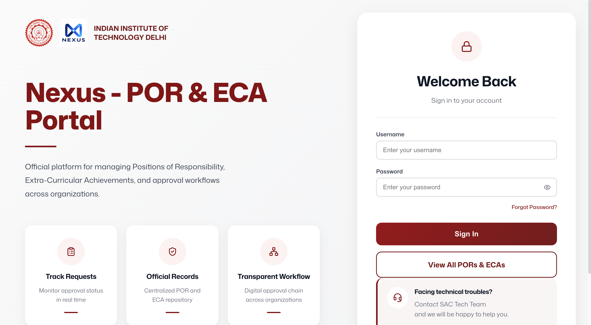

# Pushkin Mangla

**Computer Science @ IIT Delhi | Building Products That Matter**
From civic-tech startups to research to institute infrastructure, I ship across the stack.

<!-- TODO: swap in your real profile picture URL if different from your GitHub avatar -->

---

### 👨‍💻 About Me

- 🎓 Dual Degree (B.Tech + M.Tech) in Computer Science, **IIT Delhi** (ARRA Scholar)
- 🏛️ **SAC Technical Secretary** (Institute-level) & Hostel Tech Secretary, Jwalamukhi
- 📈 Pursuing a **Minor in Entrepreneurship**
- 🚀 CEO @ **B-Reporter** · CTO & Co-Founder @ **Snaccit**
- 🔬 Researching forest ecosystem resilience with causal ML under Prof. Aaditeshwar Seth (SURA project)

---

## 🚀 Startups

### 📰 B-Reporter | *"My News My Report"*
A civic/grievance reporting platform (website + mobile apps + a companion Watch app) built to get citizen reports directly to the right authorities.

`NestJS` · `React` · `MySQL` · `Redis` · `Azure`

- 🏅 2 patents · 1 publication · IIT-Delhi grant
- 🤝 Collaborations with DRDO and the Women's Commission
- 🌱 Part of the **IIT Delhi Venture Studio** accelerator

[🌐 Website](https://b-reporter.com/) · [🤖 Android](https://play.google.com/store/apps/details?id=com.iitd.breporter3) · [🍎 iOS](https://apps.apple.com/in/app/my-news-my-report/id6744141391)

<!-- Use your homepage screenshot here, save it to assets/breporter-preview.png in the repo -->

 

### 🍔 Snaccit
Co-founded and engineered the core product: a suite of 3 websites and 2 apps for pre-ordering food and skipping the wait.

[🌐 Main Site](https://www.snaccit.com/) · [🤝 Partners Portal](https://partners.snaccit.com/) · [🛠️ Admin Portal](https://admin.snaccit.com/) · [🤖 Android](https://play.google.com/store/apps/details?id=com.snaccit.app&hl=en) · [🍎 iOS](https://apps.apple.com/us/app/snaccit-pre-order-food/id6761626294)

<!-- Use your homepage screenshot here, save it to assets/snaccit-preview.png in the repo -->

---

## 🏆 Research & Recognition

### 🌲 SURA Award | Undergraduate Research
- Enhanced forest trait estimation using AEarth embeddings and developed a causal ML pipeline for climate impact assessment
- Applied Double ML to isolate the causal effects of climate hazards while controlling for ecological confounders
- Integrated multi-source geospatial datasets including Sentinel-2, MODIS, ERA5, and SPEI for forest climate analysis

`Double ML` · `AEarth Embeddings` · `Sentinel-2` · `MODIS` · `ERA5` · `SPEI`

### 🛰️ DISA Internship, IIT Delhi | Design & Innovation Intern
- Built a scalable GEE pipeline to detect drought, flood, wildfire, and high wind events, and designed a resistance-resilience framework to quantify forest recovery using kNDVI time series
- Integrated multi-source forest masks (GLC, Dynamic World, IndiaSat) for accurate land cover classification

🎪 Showcased at the **IIT Delhi Open House 2025**, presenting to faculty, researchers, institute leadership, and visitors; received a Letter of Appreciation from the Faculty Incharge, IIT Delhi Makerspace.

---

## 🏛️ Institute Work | IIT Delhi SAC

- **SAC Main Website**: the Student Affairs Council's official site
- **SAC Nexus**: ECA-POR portal for managing Extra Co-curricular Activities & Positions of Responsibility
- **NH-48**: restaurant website, React + Figma-to-code

[SAC Website](https://sac.iitd.ac.in/) · [SAC Nexus](https://sac.iitd.ac.in/nexus/login) · [NH-48](https://nh-48-website.vercel.app/)

<!-- Save your 3 screenshots to assets/sac-preview.png, assets/nexus-preview.png, assets/nh48-preview.png -->

---

## 🛠️ Other Builds

### 🗂️ TaskFlow | Jira-Inspired Agile Project Manager
A full-stack Kanban platform with role-based access control, JWT authentication, and REST APIs for secure multi-user project management, plus collaborative features like comments, notifications, and task assignment.

`JWT` · `REST API` · `RBAC`

[View Code](https://github.com/Actuallyanonymous/COP-290-Task-Board)

### 🎨 Vector Graphics Editor | C++ SVG Rendering Engine
A C++ desktop vector graphics editor built in Qt, with a custom XML/SVG parser and serializer (no third-party libraries) and an object-oriented graphics engine for shape management.

`C++` · `Qt` · `SVG`

Not deployed, no public repo yet

---

## 🧰 Also Working With

---

📫 **Reach out:** [pushkinmangla55555@gmail.com](mailto:pushkinmangla55555@gmail.com)

